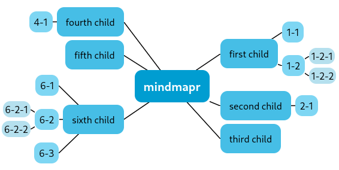

<p align="center">
  
</p>
<h1 align="center">Mindmapr</h1>
<div align="center">
Easy trees and mindmaps for react

Storyboard [here](https://mindmapr.terrible-sven.com/)

</div>

[](https://yarnpkg.com/en/package/mindmapr) [](LICENSE.md)

## Install

```bash
# Yarn
yarn add mindmapr
# NPM
npm install --save mindmapr
```

## Props 
| name                             | required | type     | default  | Description                                                                                                                                                                                                                                                                                                                                                                                                                                                                                                                            |
|----------------------------------|----------|----------|----------|----------------------------------------------------------------------------------------------------------------------------------------------------------------------------------------------------------------------------------------------------------------------------------------------------------------------------------------------------------------------------------------------------------------------------------------------------------------------------------------------------------------------------------------|
 | `items`                          | x        | object   |          | A nested object that provides `id` and `children` keys. `id`can be string or number, `children` are a list of objects, that also provide `id` and `children`.  <br/>Example:  <br/> ``` {id: 5, optionalParameter: "will be center item", children: [{id: 6, optionalParameter: "will be child of center item", children: []}]} ```                                                                                                                                                                                                    |
 | `renderItem`                     | x        | function |          | A function that returns the ReactNode you want to render as the items of the mindmap. You get the `item`, the nested `depth`, and the `state` as arguments. The `state` currently only includes `isSelected`, so you can change the appearance of the rendered item, if it got selected through click or keyboard navigation. **Also choose a background color to your item to prevent overlap with the lines**.  <br/>Example:  <br/> ``` const renderItem = (item, depth, {isSelected}) => (<div>{item.optionalParameter}</div>) ``` |
| `side`                           |          | string   | `both`   | Can either be `both`, `left` or `right`. `both` will make an usual mindmap, where items are placed left and right of the center item. With `left` and `right` you can make a tree, that will only expand in the chosen direction.                                                                                                                                                                                                                                                                                                      |
 | `addChildKey`                    |          | string   | `Tab`    | The key to press, if you want to create a child item to the currently selected item. Possible key codes are [here](https://developer.mozilla.org/en-US/docs/Web/API/UI_Events/Keyboard_event_key_values#whitespace_keys).                                                                                                                                                                                                                                                                                                              |
 | `addChildOnParentLevelKey`       |          | string   | `Enter`  | The key to press, if you want to create an item on the same level as the currently selected item.                                                                                                                                                                                                                                                                                                                                                                                                                                      |
 | `deleteItemKey`                  |          | string   | `Delete` | The key to press, if want to delete the currently selected item                                                                                                                                                                                                                                                                                                                                                                                                                                                                        |
 | `setData`                        |          | function |          | A function to feed back the changes to your state outside the component. If not provided, the mindmap will be read only                                                                                                                                                                                                                                                                                                                                                                                                                |
 | `createNewItem`                  |          | function |          | A function that creates new items. The items will be inserted at the correct positions according to the key inputs. As a paraemter, the parent item is available. If you choose to return undefined instead of an item, no item will be added.                                                                                                                                                                                                                                                                                         |
 | `overwriteLineStyle`             |          | function |          | If you want to customize the css properties of the connection lines, you can use this function.  <br/>Example:  <br/> ``` const overwriteLineStyle = (depth) => ({stroke: "#ddd", strokeWidth: 1})  ```                                                                                                                                                                                                                                                                                                                                |
